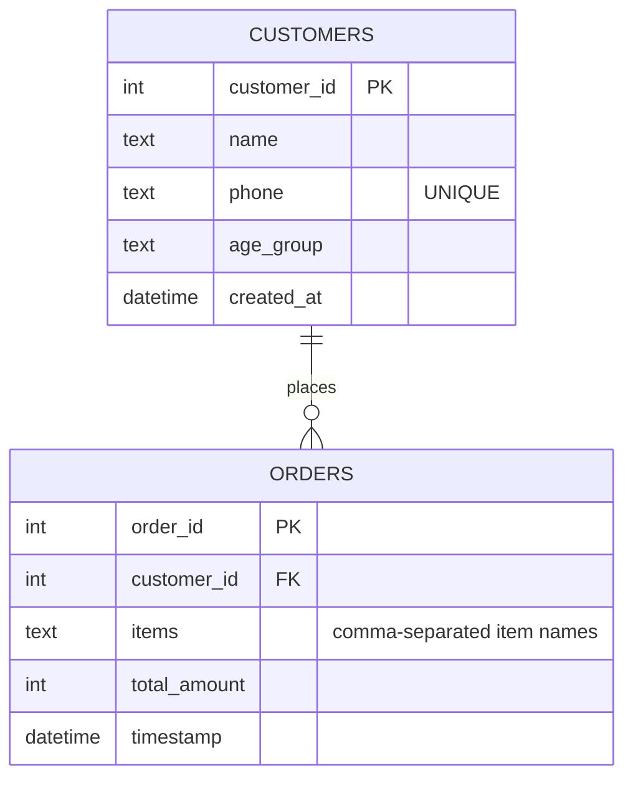

# 🍔 Burger App

A smart, end-to-end food ordering system — built with a clean Streamlit UI, a relational SQLite backend, and an admin panel that surfaces business insights through association rule mining (Apriori).

**Live app:** [burger-app.streamlit.app](https://burger-app.streamlit.app/)

---

## Tech Stack

- **Frontend / App Framework:** Streamlit
- **Database:** SQLite — relational schema with foreign-key-linked tables
- **Machine Learning:** `mlxtend` (Apriori algorithm) for market basket / association rule mining
- **Language:** Python
- **Deployment:** Streamlit Community Cloud

---

## What It Does

1. A customer enters their phone number.
   - New number → asked for name and age group, then can order.
   - Existing number → recognized instantly, greeted by name.
2. They build a cart from the menu (burgers, fries, nuggets, coke, softy, veg burger), with live total calculation.
3. Placing an order writes a new row to `orders`, linked to that customer's `customer_id` — a real relational write, not a flat log.
4. An admin panel shows recent orders and **association rules mined from actual order history** — which items tend to be bought together, and with what confidence — giving a business-style read on customer behavior, not just a data dump.

---

## The Journey: From Voting Widget to Ordering System

This project is the direct evolution of my first Streamlit build, **IPL Fan Pulse** — a fan voting app where users picked their favorite team or player. That project was mainly about learning to work with Streamlit's widgets and session state.

Burger App took the same underlying interaction pattern — a user makes a selection, the app records it — and rebuilt it into something structurally different: **"vote" became "place order,"** but everything underneath it changed. Instead of a single vote tied to a session, this needed a real relational schema (a customer placing multiple orders over time), returning-user recognition by phone number, and a backend capable of feeding a machine learning algorithm real transactional data.

In short: the first project was about learning to play with widgets. This one is about using those same widgets as the front end for a production-style system — relational database, real backend logic, and an ML-driven analytics layer on top.

---

## Database Schema

Two tables, one relationship: a customer can place many orders, but each order belongs to exactly one customer.



**Design notes:**
- `phone` is `UNIQUE` on `customers` — this is the entire basis of returning-customer recognition. No login, no password, just a direct lookup.
- `items` is stored as a comma-separated string (e.g. `"Company Burgers,Coke Ka Cola,Coke Ka Cola"`), which is enough to reconstruct a full cart and feed directly into the Apriori algorithm for association mining.
- `total_amount` is computed and stored at order time, keeping order-history queries fast and simple.
- `created_at` / `timestamp` default to `CURRENT_TIMESTAMP`, giving every row a built-in audit trail.

---

## Working Flow

**Customer side:**

```
Enter phone number
      │
      ▼
Valid 10-digit number? ──No──► Show error, stop
      │ Yes
      ▼
Phone found in customers? ──Yes──► "Welcome back, {name}"
      │ No
      ▼
Ask for name + age group
      │
      ▼
Select items → cart & total update live
      │
      ▼
Click "Place Order"
      │
      ▼
New customer? ──Yes──► INSERT into customers → get customer_id
      │ No ──────────► use existing customer_id
      ▼
INSERT into orders (customer_id, items, total_amount)
      │
      ▼
Show order confirmation with order_id
```

**Validation on "Place Order"** — all conditions must pass:
1. Phone number entered
2. Phone is exactly 10 digits
3. Cart isn't empty
4. Name isn't blank for new customers

---

## The Admin Panel

There are two ways into the same admin view:

1. **The direct route** — scroll to the "Admin Panel" section at the bottom and enter the password.
2. **The secret door** — type `999` into the phone number field instead of a real phone number, which surfaces the same password prompt instantly, without scrolling.

Both paths call the same shared `render_admin_panel()` function, so they always show identical data. This is a demo project, so the admin password is intentionally visible in the frontend source rather than secured through auth or environment variables — that tradeoff is deliberate, not an oversight.

**What the admin panel shows:**
- **Recent orders** — a live table of the last N orders (adjustable, 1–10), with order ID, customer ID, items, total, and timestamp.
- **Association rules** — the core ML-driven feature of the app. Running Apriori over the full order history surfaces patterns like *"customers who buy Frenchie Fries and Coke Ka Cola also buy Company Burgers, with 73% confidence."* This is what turns raw transaction logs into an actual business insight — the kind of cross-sell signal a real burger stall could use to decide what to bundle or promote.

---

## Backend Behavior

- **Auto-seeding:** if `orders` is empty on startup, the app populates demo transaction data via `seed_data.py`, so the association rules and recent-orders view have real data to work with from the very first load — no manual setup required.
- **Deployment fix:** the app was originally deployed with a committed database file, which Streamlit Cloud mounts as read-only, silently blocking writes. This was resolved by removing the committed database file and gating the seed step behind a `seed_on_empty` check, so a fresh, writable database is created on first boot in any environment.
- **Connection handling:** the SQLite connection is created once via `@st.cache_resource` rather than reopened on every rerun, since Streamlit reruns the entire script on every widget interaction.
- **Raw SQL, no ORM:** all queries go through `sqlite3` directly — a deliberate choice to work with schema design and SQL hands-on rather than abstracting it away.

---

## Running Locally

```bash
git clone https://github.com/aayushman-jha/burger-app.git
cd burger-app
pip install -r requirements.txt
streamlit run streamlit_app.py
```

The database and demo transaction data are created automatically on first run.
